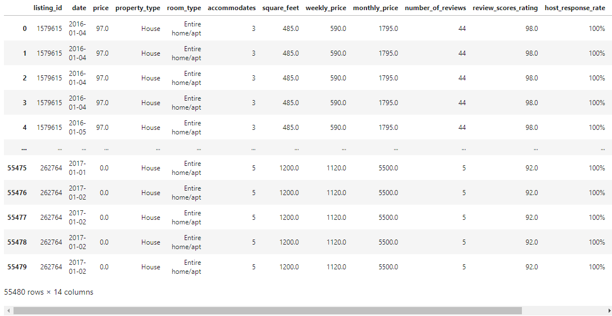

# **Project 2 - Seattle Airbnb**
The aim of this project is to investigate patterns of successful airbnb locations within the Seattle, Washington area. The two .csv files were joined on the “listing_id” and “id” columns respectively. Numerous data factors were cleaned and taken into consideration such as zip code, accommodation, host status, price and reviews rating. Relationships between the data can be investigated in PostgreSQL to potentially glean new insights into the statistically relevant operations of Seattle airbnbs. The proposal can be found [here](https://docs.google.com/document/d/1zOba1ACNFKTRwIRvSfEhbklf3GlRPqUh2XkHwhNO2ZI/edit?usp=sharing).

## **Members**
Jose Sandoval  &emsp; &emsp; Vanessa Kemp 
Nick Taheri   &emsp; &emsp; &emsp;  Aidan Thompson

## **Step 1: Extraction**
Two .csv files were utilized for this project. The files are located within the ‘Resource’ folder which were both acquired from https://www.kaggle.com/datasets/airbnb/seattle.

## **Step 2: Transform**
Each of the .csv files were examined for relevance and usability to achieve the project’s target. The following lists the columns of each .csv file which were chosen to be cleaned using Pandas/Jupyter Notebooks.

•         	[**calendar.csv**](https://github.com/VLKemp/Project_2/blob/main/Resources/calendar.csv) : The listing_id, available and price columns.

•         	[**listings.csv**](https://github.com/VLKemp/Project_2/blob/main/Resources/listings.csv) : The  id, host_response_rate, host_acceptance_rate, host_is_superhost, zipcode, price, number_of_reviews, review_scores_rating, property_type, room_type, accommodates, square_feet, weekly_price and monthly_price columns.

Detailed steps to clean and transform each .csv file:

1. Import Dependencies

   Import pandas  
   from sqlalchemy import create_engine  
   from sqlalchemy import inspect  

2. Create the paths to the .csv files

   ~~~~python	
   calendar_file = "Resources/calendar.csv"
   calendar_df = pd.read_csv(calendar_file, encoding="utf8")
   ~~~~
   
   ~~~~python
   listings_file = "Resources/listings.csv"
   listings_df = pd.read_csv(listings_file, encoding="utf8")
   ~~~~

3. Read the .csv file into a data frame

4. Create a copy with only the desired columns with .copy()

5. Delete rows with missing information using .dropna()

6. Delete all duplicates with .drop_duplicates() 

7. View the data frame to ensure successful cleaning

8. Ascertain data types of columns with .dtypes

9. Convert columns to usable data types 

   Convert the date column to datetime with pd.to_datetime()  
   Convert the string ‘price’ column to float using .astype(float)  
   To convert the string ‘weekly_price’ and ‘monthly_price’ to numeric values, remove the currency signs with .replace() then convert to numeric using pd.to_numeric  
   Convert  ‘accommodates’ and ‘square_feet’ with pd.to_numeric  

10. Replace the NaN values in calendar.csv using .fillna(‘$0’)

11. Filter the zipcode column with .str.len() == 5 to retain accurately input data

12. Check the .csv data types have been successfully altered with .dtypes

## **Step 3: Load**

The process of loading data frames into pgAdmin4 is accomplished in Jupyter Notebooks. 

Establish connection to a local database.

Convert the data frames using .to_sql(). To confirm, query each data frame with pd.read_sql_query.head().

Perform SQL joins of the data frames on the listing_id column.
df = r””” SELECT df1.column_name, df2.column_name, df3.column_name, df4.column_name
FROM df1
JOIN df2 ON df1 = df2 
JOIN df3 ON df1 = df3 
JOIN df4 ON df1 = df4”””

Check the join is successful using pd.read_sql_query.head().

The engine uploads the SQL data.

The created SQL schema has four tables: 
 •	'calendar' 
 •	'listings_host' 
 •	'listings_reviews' 
 •	'type_and_price' 
 
 Note: A postgresSQL protocol was employed to fulfill credentials requirements.

## Final Table

The final database, as viewed above, contains all of the cleaned and transformed columns. Utilizing SQL syntax in Jupyter Notebooks with the df = r”””code””” method or using pgAdmin4, the joined data frame is ready for querying. Is there a correlation between availability of a listing and local holidays? Is there a connection between price of a listing and host response rate? What is the average savings when booking for a week or month compared to a few days? The data allows for analysis of these queries and more for Seattle airbnbs.
